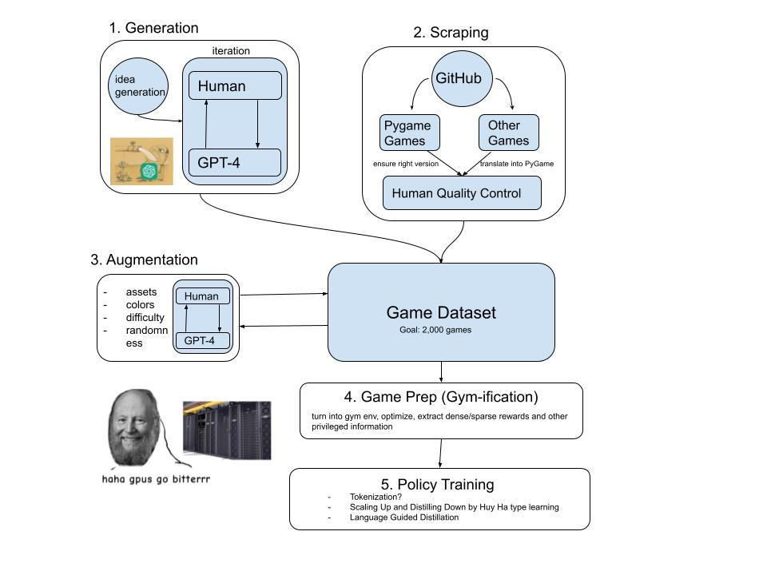

# code-as-environment
### Study of embodied generalization through LLM generated 2D games. 

## Motivation

An extremely powerful quality of humans is our ability to quickly learn the rules of and generalize to new __embodied environments__. A very simple example of this is video games; given a new video game and little to no instructions, humans can swiftly pick up the controls, learn the game mechanics, and start making meaningful progress. 

While researchers have long tried to create agents that generalize to new environments.
Even in simple 2D environments (e.g. Atari Games), none of the so-called generalist agents have been able to generalize to new environments as quickly as humans. 

We believe that a major reason is that we do not have a sufficiently diverse set of environments to train on. Even the largest attempts to create generalist agents have not used trained on more than ~200 environments, and that seems to be the furthest we can get. Not to mention that the number of such environments are currently bottlenecked because

- Many developers are interested in complex dynamics that may be entertaining for humans, but make it too difficult to train agents on these games. 
- The human labor that goes into a new environment does not justify the gains for the learning agent, which prevents labs and organizations from investing in projects to generate more of these environments. 
- We don't even have a predefined procedure to generate ideas for novel games. 

To overstep the time and monetary costs of producing such games we propose leveraging the game understanding and the game generation abilities of the recent Large Language Models (LLMs) in multiple ways.

1.  Game Generation with Human Feedback

    LLMs can be used for 

    - Coming up with game ideas (inspiration by real-life scenarios could be a big plus here)
    > "A game where you are a garbage truck driver and you have to collect all the garbage in the city before the time runs out."
    - Translating the game idea into the corresponding game parameters
    > `game genre: action, movement type: top-down, game mechanics: collecting, game dynamics: None, game rules: time limit, etc.`
    - Coding the game in a simple 2D game development framework such as PyGame
    - Iterating on the game with the feedback of a human
        - *Alper:* In my experience GPT-4 is just good enough to be able to make games with human feedback. Making this completely automatic would be extremely difficult. This is why we must focus on making this process powerful (good prompt engineering) and streamlined (good UI/UX). 
    
    &nbsp;

2. Intelligent Scraping
    - There are so many games that have accumulated on GitHub that are created as simple games or RL environments that could teach an agent a lot about the physical world e.g. https://github.com/columbia-ai-robotics/diffusion_policy/blob/main/diffusion_policy/env/pusht/pusht_env.py. Through a few heuristics, we could find all pygame environments in python.
    - Some of these games may be spread throughout multiple files, or the assets could be in various folders. Some games may be too simple, and some too complicated. We hope that LLMs will be able to recognize these edge cases and help us filter out useful games.

        &nbsp;

3. Augmenting Pre-Existing Games
4. Converting PyGame into Learnable RL Environments
5. Policy Training

Further ideas to discuss here:
- Foundation model characterized by in-context learning abilities

--- 

## TODO: 
- Pin down parameters of game generation.
    - > "Imagine you have a black box that takes in some parameters and automatically generates a 2D game. What parameters would you require to generate all Atari games?

--- 

## Timeline

- July 22th - Official Start of the Project
- August 15th - Prototype for Game Generation with PyGame
- August 30th - Refined Game Generation with PyGame
- September 15th - 
- September 15th - Translation into JAX

---

## Related Works

- GATO by Deepmind
- RoboCAT by Deepmind
- Scaling Up and Distilling Down by Huy Ha
- GenSim: Robotic Simulation Generation Through LLM

